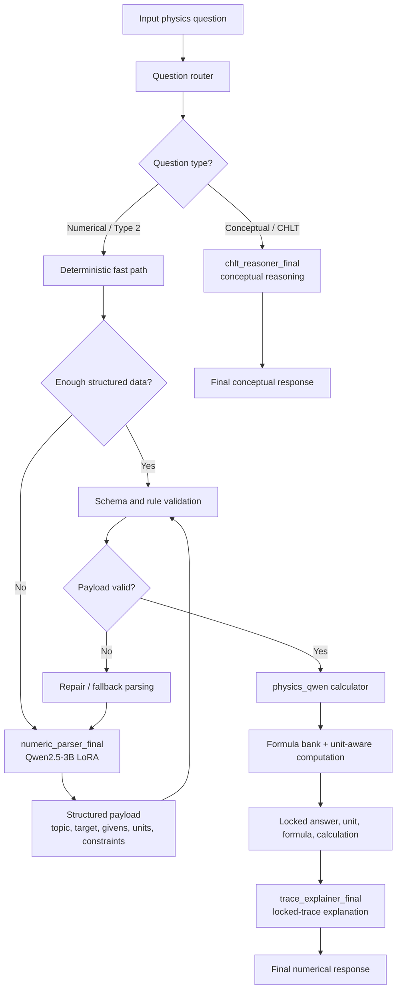

# Physics Question Answering with Qwen

**Physics Question Answering with Qwen** is an **agentic calculator-first hybrid reasoning
system** for physics question answering, developed for the EXACT 2026 workflow.
The project combines deterministic physics solvers, schema-based validation,
Qwen2.5-3B LoRA adapters, and rule-based routing to answer numerical and
conceptual physics questions with traceable intermediate steps.

The system is not designed to let a language model freely generate final
numerical answers. Instead, the model helps understand the question, extract
structured information, route the request, and explain the result, while the
verified calculator owns the final answer, unit, formula, and calculation.

## Core Idea

The project follows an agentic pipeline: each module has a narrow role, and the
runtime coordinates them as small reasoning agents. A question can move through
different paths depending on whether it is numerical, conceptual, or requires
repair after a failed parse.

- **Router** decides the question path.
- **Parser adapter** extracts structured physics payloads.
- **Validator** checks schema, quantities, units, and constraints.
- **Calculator** selects formulas and computes locked numerical results.
- **Explainer adapter** turns verified traces into readable explanations.
- **Conceptual reasoner** handles non-numerical and CHLT-style questions.

This makes the system easier to audit than a single end-to-end generative model.

## Pipeline Diagram



## Runtime Flow

For numerical questions, the preferred path is:

```text
question
  -> route question type
  -> try deterministic fast path
  -> use numeric_parser_final if extraction is incomplete
  -> validate payload with schema and rules
  -> solve with physics_qwen calculator and formula bank
  -> lock answer, unit, formula, and calculation
  -> explain with trace_explainer_final when needed
```

For conceptual questions, the system bypasses the calculator and routes the
question to `chlt_reasoner_final`.

## Main Components

| Component | Purpose |
| --- | --- |
| `physics_qwen` | Core calculator package for formula selection, quantity parsing, payload validation, and final numerical solving. |
| `numeric_parser_final` | LoRA adapter that converts natural-language physics questions into structured calculation payloads. |
| `trace_explainer_final` | LoRA adapter that explains verified calculator traces without changing answer, unit, formula, or calculation. |
| `chlt_reasoner_final` | LoRA adapter for conceptual, theory-based, and CHLT-style physics questions. |
| `question_router` | Routing resources for separating numerical and conceptual paths. |
| `schemas` | JSON schemas that constrain adapter outputs and make validation explicit. |

## Repository Layout

```text
.
|-- src/                         # Source workspace and adapter builders
|   |-- physics_qwen/             # Core calculator, formula bank, validators
|   |-- adapters/                 # LoRA adapter datasets, notebooks, metadata
|   |-- datasets/                 # Dataset notes and adapter seed datasets
|   |-- schemas/                  # JSON output schemas
|   |-- docs/                     # Source-level technical notes
|   `-- notebooks/                # Development notebooks
|-- data/
|   `-- raw/                      # Raw and updated EXACT data snapshots
|-- docs/
|   `-- papers/                   # Reference papers, slides, extracted notes
|-- notebooks/
|   `-- type1/                    # Type 1 API notebook work
|-- tests/
|   `-- samples/                  # Holdout and stress-test samples
|-- scripts/                      # Utility and evaluation scripts
|-- submissions/
|   `-- current/                  # Current submission/export package
|-- releases/
|   `-- hybrid_v2_final/          # Final Hybrid V2 package and report
`-- README.md
```

## Important Paths

- Core calculator logic: `src/physics_qwen/`
- Adapter plan: `src/ADAPTERS.md`
- Adapter dataset builders: `src/adapters/*/build_*_dataset.py`
- Output schemas: `src/schemas/`
- Dataset notes: `src/datasets/README.md`
- Raw/update datasets: `data/raw/`
- Supporting papers and extracted notes: `docs/papers/`
- Current submission package: `submissions/current/`
- Final package report: `releases/hybrid_v2_final/FINAL_PACKAGE_REPORT.md`

## Data and Artifacts

This repository keeps source code, adapter datasets, schemas, notebooks,
tokenizer/config metadata, reports, and submission documents so the project can
be inspected without requiring every large training artifact.

Large model weights, checkpoints, packaged zip bundles, cache files, runtime
URLs, and duplicated generated outputs are intentionally excluded from Git.
Those artifacts should be restored separately when running the full deployed
system.

## Quick Check

The main adapter builders can be checked with:

```bash
python -m py_compile src/adapters/numeric_parser_final/build_numeric_parser_final_dataset.py
python -m py_compile src/adapters/trace_explainer_final/build_trace_explainer_final_dataset.py
python -m py_compile src/adapters/chlt_reasoner_final/build_chlt_reasoner_final_dataset.py
```
